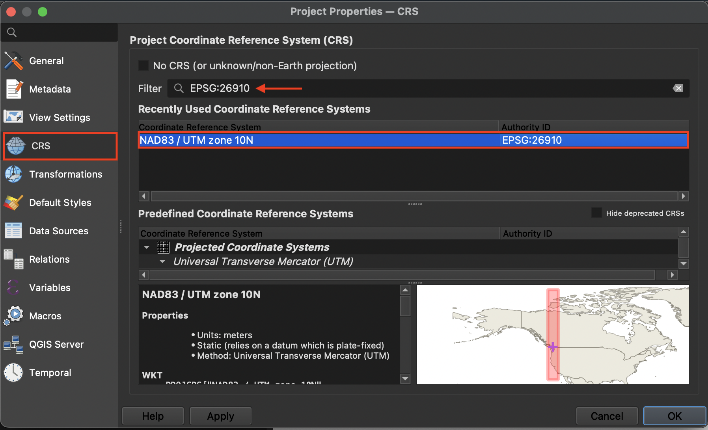

# Setting up a QGIS Project 
 
*1*{: .circle .circle-purple} Open a new QGIS project file (.qgz) and save it as "network-analysis_YOUR_NAME"
 
     
*2*{: .circle .circle-purple} From the **Project** menu at the top of your screen navigate to **Properties**. Set your project CRS to EPSG:26910 - NAD83 UTM zone 10N
   

     
 
*3*{: .circle .circle-purple} In the Browser panel to the left of your screen, right click "Favorites" and connect the workshop-data folder as a favorite directory. Once connected, expand the folder to see its contents. 
     
 
*4*{: .circle .circle-purple} Add the following layers **in order** to your map canvas: 

- census-DAs.geojson
- urban-blocks.geojson
- street-networks.geojson

<!-- - street-networks.geojson
- business-licenses.geojson -->

<!-- We add census-DAs.geojson first because it has the same CRS as the project. Urban-blocks does not have the same CRS as your project and, unless the option is disabled, QGIS will automatically change your project projection to that of the first layer added. OSM-street-networks and especially business-licenses are very large files and will take a minute to load.  -->

<!-- **Re-order your layers to match** the image below.  -->
The automatic symbology (i.e. styling) given to your layers may differ - feel free to change it now. 
<!-- **Uncheck business-licenses in your layers panel to hide it from view.** This will make zooming and panning around your map canvas faster because business-licenses won't have to re-load everytime. -->
        

